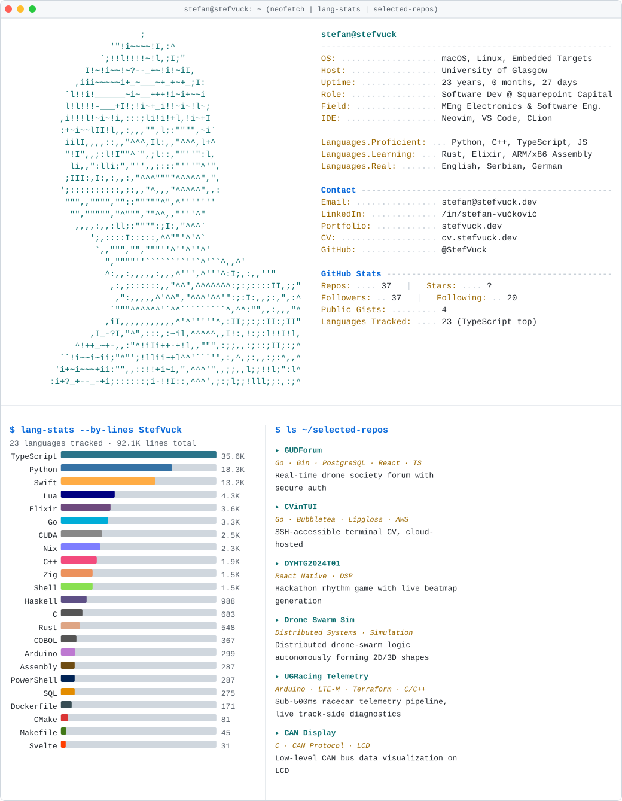

<!--TERMINAL-PROFILE:START-->
<picture>
  <source media="(prefers-color-scheme: dark)" srcset="assets/profile_dark.svg">
  <source media="(prefers-color-scheme: light)" srcset="assets/profile_light.svg">
  
</picture>
<!--TERMINAL-PROFILE:END-->

